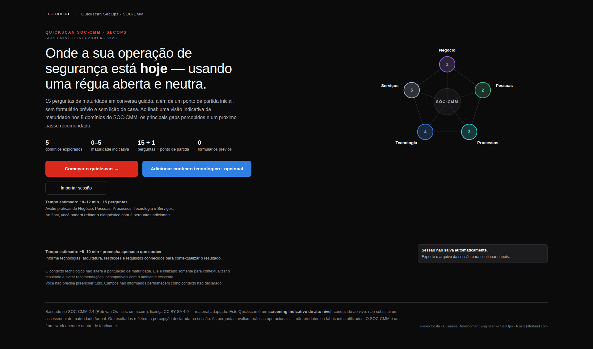

# Quickscan SecOps · SOC-CMM

Instrumento de **screening indicativo de alto nível** da maturidade de operações de segurança.
Em 15 perguntas distribuídas por cinco domínios — Negócio, Pessoas, Processos, Tecnologia e
Serviços — produz score de 0 a 5, estágio de maturidade, gaps, cenário-alvo, recomendações
contextuais e um relatório em PDF pronto para leitura executiva.

> **Screening indicativo.** Não substitui assessment formal, auditoria, desenho de arquitetura ou
> proposta comercial. O resultado orienta conversa e priorização — não fundamenta contrato sozinho.



## Estado do produto

| versão | o que é | onde está |
|---|---|---|
| **v3.2.2** | **produção publicada.** É a versão liberada e atualmente em uso. | [release `v3.2.2`](https://github.com/oflavioc/quickscan-secops-v32-phase5-dev/releases/tag/v3.2.2) |
| **v3.2.1** | **versão anterior**, preservada e verificada como caminho de rollback. | [release `v3.2.1`](https://github.com/oflavioc/quickscan-secops-v32-phase5-dev/releases/tag/v3.2.1) |

A v3.2.2 foi avaliada pelo proprietário e por revisão externa independente, promovida a produção e
substituiu a v3.2.1. **A versão corrente do produto é a v3.2.2.** A v3.2.1 permanece preservada e
verificada, disponível para rollback imediato. Um arquivo `*_dev.html` na árvore de trabalho é
candidata, nunca release: antes de avaliar ou distribuir qualquer HTML, confira a identidade
declarada no manifesto da rodada.

Produção, dados de cliente e infraestrutura de publicação **não fazem parte deste repositório**.
Tags, releases e deployment são atos separados da implementação e da auditoria.

## O que o Quickscan é, em linguagem simples

O Quickscan é uma **conversa guiada de cerca de dez minutos** sobre como a segurança é operada hoje.
Quem conduz faz as perguntas ao vivo e registra a resposta que mais se aproxima da realidade
observada. Não há formulário prévio, não há lição de casa e não há certo ou errado.

**O que ele avalia:** práticas operacionais — como o time detecta, investiga, responde, mede e
melhora. Ele não avalia produtos, fabricantes ou arquitetura.

**O que ele entrega:** uma leitura indicativa de maturidade por domínio, os gaps mais evidentes, uma
comparação entre a situação atual e um cenário-alvo declarado, e um próximo passo recomendado.

**O que o contexto tecnológico influencia:** as **recomendações** e a leitura arquitetural. Informar
o que já existe no ambiente evita sugerir o que a organização já tem e ajuda a priorizar.

**O que o contexto tecnológico NÃO influencia:** a **pontuação**. Ele não altera perguntas, respostas,
score, estágio de maturidade, suficiência de evidência nem gaps. Tecnologia, isoladamente, nunca
aumenta a maturidade — possuir uma ferramenta não prova que o processo exista ou seja seguido. Por
isso o contexto tecnológico é sempre **opcional**: uma sessão sem ele produz exatamente a mesma nota.

Perguntas sem resposta confiável devem usar **`Não sei · precisa validar`**. Isso não pontua zero:
entra no resultado como item a validar. `n/d` e zero são coisas diferentes, e a ferramenta mantém a
distinção do começo ao fim.

## Como usar localmente

A aplicação é um **único arquivo HTML autocontido**: sem servidor obrigatório, sem instalação, sem
dependência de runtime.

```text
quickscan_secops_soccmm_v3_2_dev.html
```

Abra o arquivo diretamente no navegador (duplo clique, ou `Arquivo → Abrir`), ou sirva o diretório
por qualquer servidor estático local. Navegadores baseados em Chromium são o alvo de referência.

**Nenhum dado sai da máquina.** A ferramenta não faz requisição externa, não usa CDN, fonte remota,
analytics nem telemetria, e não grava nada no armazenamento do navegador. Tudo o que é digitado vive
apenas na aba aberta — e desaparece quando ela fecha.

### Sessão: exportar e importar

Como não há gravação automática, **exportar o JSON da sessão é o que preserva o trabalho**.

- **Exportar:** na tela de resultados, use a ação de exportar sessão. O arquivo `*.session.json`
  contém apenas os *inputs canônicos* — respostas, notas, prioridades e contexto declarado.
- **Importar:** na tela de abertura, use **Importar sessão** e selecione o JSON. Tudo o que é
  derivado (score, estágio, gaps, recomendações) é **recalculado** na importação, nunca lido do
  arquivo. Isso é deliberado: o arquivo guarda o que foi declarado, não o que foi concluído.
- Exportar é o passo **obrigatório antes de trocar de cliente**.

Para reconstruir o HTML a partir das camadas do projeto:

```text
python3 build_v32_html.py
```

O build é determinístico: duas execuções sobre as mesmas fontes produzem o mesmo SHA-256.

## Fluxo resumido

1. inicie uma sessão nova ou **importe** um JSON existente;
2. responda com base em evidência observável, usando `Não sei · precisa validar` quando for o caso;
3. registre evidências e observações por pergunta;
4. declare até três prioridades do negócio;
5. informe o contexto tecnológico — **opcional**: ele não muda a nota, mas muda a recomendação;
6. revise resultados, gaps e cenário-alvo;
7. **exporte a sessão** e gere o relatório/PDF.

## Tela de abertura

Os dois caminhos de entrada ficam lado a lado: **Começar o quickscan** e **Adicionar contexto
tecnológico · opcional**, com **Importar sessão** logo abaixo. O emblema dos cinco domínios é
identidade gráfica e traz uma explicação curta por domínio; ele não representa score nem estágio.

## Contexto tecnológico

O editor de contexto é o mesmo nas duas entradas — pela tela de abertura ou pela seção correspondente
nos resultados — e está organizado em duas regiões: **Capabilities de segurança** e **Ambiente e
condicionantes**. Cada região agrupa famílias que **começam recolhidas**: abra apenas as que
interessam à conversa e o restante permanece fora do caminho. O que você abrir continua aberto
enquanto estiver editando.

Os controles **(i)** existem onde há ambiguidade real de significado: no nome de cada capability, no
cabeçalho de cada família, nos campos de arquitetura, nos subgrupos de requisitos e em cada sinal
declarado. Rótulos que já se explicam sozinhos não carregam controle de ajuda.

Em **Plataformas e licenciamento já existentes** a explicação é única, no cabeçalho do grupo: a seção
registra **base instalada e direitos de uso** — o que está em produção e o que está licenciado ou
contratado. Declarar isso **não prova implantação, cobertura nem maturidade**, e nada nessa seção
altera score, estágio ou gaps.

## Tela de resultados

Em desktop, o resultado é um workspace com trilho de navegação lateral e nove seções na mesma página,
nesta ordem: **visão executiva · cenário-alvo · contexto tecnológico (opcional) · evidência e
suficiência · domínios e heat map · prioridades do negócio · gaps observados · formas de apoio ·
relatório e sessão**. Nada fica escondido atrás do trilho: ele é um sumário, não um menu de abas.

Quando a evidência é **suficiente**, a tela mostra só a linha *“Qualidade da evidência · Suficiente”*
e guarda o painel técnico no disclosure **“Base de evidência”**; quando é **insuficiente**, o painel
completo sobe para logo depois da visão executiva e o resultado aparece **bloqueado**.

O **cenário-alvo** vem antes do contexto tecnológico porque é decisão de negócio, não de produto:
ele projeta a comparação Current × Target e **não altera as respostas nem o score atual**. Os gaps
aparecem em dois grupos separados — **altos** e **moderados**. Em telas estreitas, o trilho vira uma
barra de seções e o conteúdo passa a uma coluna.

A aplicação **não salva automaticamente**. Exportar o JSON é o que preserva o trabalho — e é o passo
obrigatório antes de trocar de cliente.

## Documentação

O manual completo de utilização e interpretação está em **[`USER_GUIDE.md`](USER_GUIDE.md)**, e cobre
a semântica das respostas, a diferença entre `n/d` e zero, a influência do contexto tecnológico sobre
o resultado, a leitura do relatório, o cenário-alvo, as recomendações e o checklist pré-entrega.

## Revisão independente

Uma revisão externa deve receber um **pacote fechado e verificável**, não uma cópia informal do
diretório de desenvolvimento. O pacote contém o HTML autocontido da candidata, um README próprio, o
manual, um brief de escopo, as limitações conhecidas, o prompt de auditoria, capturas de referência e
um `MANIFEST_SHA256.txt`.

**Verificação de identidade antes de qualquer análise — nesta ordem:**

1. recalcule o **SHA-256 do próprio ZIP** e compare com o sidecar `.sha256` entregue junto dele;
2. extraia o pacote e execute o **manifesto interno** (`sha256sum -c MANIFEST_SHA256.txt`), exigindo
   `OK` em todas as linhas;
3. confirme que o HTML do pacote é **byte-idêntico** ao HTML da candidata sob revisão;
4. só então comece a análise.

Se qualquer um dos três primeiros passos divergir, o pacote não representa a candidata e a análise
não deve prosseguir. Registre como **não executada** — nunca como aprovada — qualquer verificação que
o ambiente não permita realizar.

Cada rodada gera um pacote novo: assim que qualquer byte do HTML candidato muda, o pacote anterior
fica **superado** e não pode ser apresentado como corrente. Confira sempre a data e o SHA-256 do
pacote que você recebeu.

Não inclua no pacote sessões reais, PDFs de cliente, dados de assessment, credenciais, nem qualquer
configuração de produção, de rede ou de publicação. Pareceres anteriores podem orientar a seleção de
riscos, mas não devem ser tratados como evidência autossuficiente do estado corrente.

## Identidade da versão

A versão do runtime é publicada pela própria aplicação em `window.__QS_BUILD_META.toolVersion` e
aparece no rodapé de metadados do relatório, junto da identidade do engine. Consulte sempre esses
valores — em vez de anotá-los aqui, onde envelheceriam.

## Dados de cliente

Sessões (`*.session.json`), relatórios em PDF e qualquer evidência de assessment **não pertencem a
este repositório**. Guarde-os no repositório de dados do cliente, com o mesmo cuidado dado a qualquer
documento de avaliação. Não registre segredos, credenciais ou dados pessoais desnecessários nos
campos de evidência.
